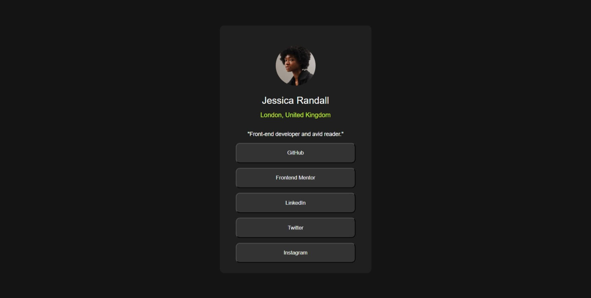

# Frontend Mentor - Social links profile solution

This is a solution to the [Social links profile challenge on Frontend Mentor](https://www.frontendmentor.io/challenges/social-links-profile-UG32l9m6dQ). Frontend Mentor challenges help you improve your coding skills by building realistic projects.

## Table of contents

- [Overview](#overview)
  - [The challenge](#the-challenge)
  - [Screenshot](#screenshot)
  - [Links](#links)
- [My process](#my-process)
  - [Built with](#built-with)
  - [What I learned](#what-i-learned)
  - [Continued development](#continued-development)
  - [Useful resources](#useful-resources)
- [Author](#author)
- [Acknowledgments](#acknowledgments)

**Note: Delete this note and update the table of contents based on what sections you keep.**

## Overview

### The challenge

Users should be able to:

- See hover and focus states for all interactive elements on the page

### Screenshot

### Links

- Solution URL: [git repo](https://github.com/CristiMiri/Social-links-profile)
- Live Site URL: [git page](https://cristimiri.github.io/Social-links-profile/)

## My process

### Built with

- Semantic HTML5 markup
- Flexbox
- CSS Selectors

### What I learned

I learned how to use css selectors.

### Useful resources

- [resource](https://www.w3schools.com/css/default.asp) - This helped me with common use of css.

## Author

- Frontend Mentor - [@CristiMiri](https://www.frontendmentor.io/profile/CristiMiri)
